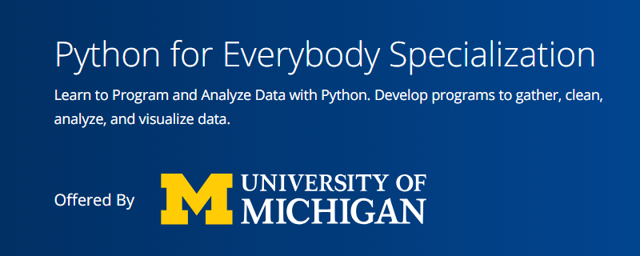

# Coursera-Python-For-Everyobody-Specialization

[Python for Everybody Specialization](https://www.coursera.org/specializations/python?)

# Overview Courses 

[1.Programming for Everybody (Getting Started with Python)](https://www.coursera.org/learn/python?specialization=python)

[2.Python Data Structures](https://www.coursera.org/learn/python-data?specialization=python)

[3.Using Python to Access Web Data](https://www.coursera.org/learn/python-network-data?specialization=python)

[4.Using Databases with Python](https://www.coursera.org/learn/python-databases?specialization=python)

[5.Capstone: Retrieving, Processing, and Visualizing Data with Python](https://www.coursera.org/learn/python-data-visualization)

